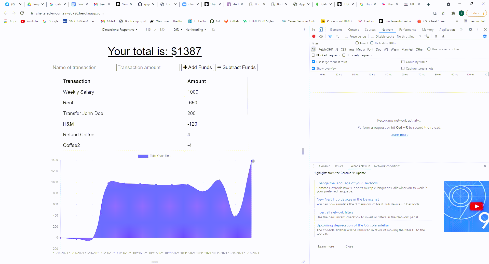
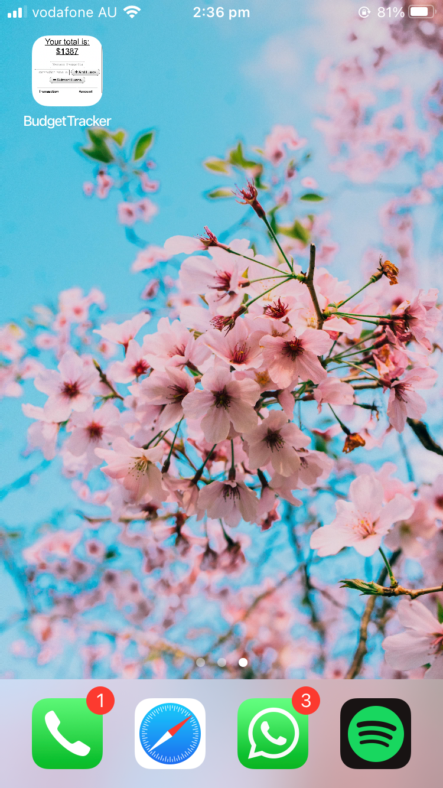
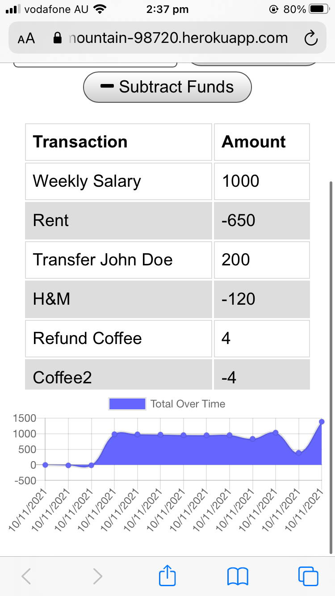

# PWA Budget-Tracker

[](https://opensource.org/licenses/MIT)    

## General Information
 
* [Deployed Web Application](https://sheltered-mountain-98720.herokuapp.com/)
* [GitHub repository of Budget-Tracker](https://github.com/ZahraMertens/Budget-Tracker.git)


## Table of Contents
1. [General Information](#general-information)
2. [Task Description](#task-description)
3. [Mock-Up](#mock-up)
4. [Installation Instructions](#installation-instructions)
5. [Technologies Used](#technologies-used)
6. [User Story](#user-story)
7. [Business Context](#business-context)
8. [Usage](#usage)
9. [Credits](#credits)


## Task Description

The Web Application is a Budget-Tracker which allows a user to to able to keep track of their expenses. The user is able to add and substract funds into the tracker and a graph displays the progress of the users expenses. The web application is also a PWA (Progressive Web App) which allows the user to add the webpage as a bookmark on the homescreen of the phone or desktop and can operate offline. When the user adds expenses offline and goes back online, the offline entries shold be added to the tracker.

## Mock-Up

🎥 The GIF shows the Web Applications offline functionality:



 

## Installation Instructions

### Installation as "Add to homescreen" Application of phone:


### Installation of Code:

* First the user must clone the [GitHub Repo](https://github.com/ZahraMertens/Budget-Tracker.git) on its OS.

* Open the repository on your device with VS Code (or any other program)

* Open the command line at the folder location OR the integrated terminal 

* First, you MUST install the npm packages by running "npm install" in the terminal

* To initialize the database the user must have mongoDB installed and then run "mongo" in the terminal

* To un the application on your local device the user must run "npm start" in the terminal and will see a link such as "http://localhost:3000" if the user runs the link in the browser the application should run on the local host.


## Technologies Used

* JavaScript
* Node.JS
* Express.JS
* MongoDB
* Dotenv
* Mongoose
* MongoDB Atlas (Cloud)
* Service Worker
* Web Manifest
* IndexedDB

## User Story

```
AS AN avid traveller
I WANT to be able to track my withdrawals and deposits with or without a data/internet connection
SO THAT my account balance is accurate when I am traveling
```

## Business Context

A consumer is more aware of his/her expenses when entering all expenses and deposits into the budget tracker.

## Usage

* WHEN I open the application in the browser THEN I am presented with a graph and input fields

* WHEN I input an expense name and amount i can decide to substract funds or add funds to my budget tracker

* WHEN I enter the funds a list of all entered expenses will appear above the graph and the graph will display my expenses more visially

* WHEN the user inputs a withdrawal or deposit when offline THEN it will be shown on the page, and added to their transaction history when their connection is back online.


## Credits

* https://www.mongodb.com/
* https://mongoosejs.com/docs/
* https://cloudconvert.com/mp4-to-gif
* https://developer.mozilla.org/en-US/docs/Web/Manifest
* https://developer.mozilla.org/en-US/docs/Web/API/IndexedDB_API
* https://developer.mozilla.org/en-US/docs/Web/API/Service_Worker_API


© 2021 Zahra Mertens, Budget-Tracker